| Referência (key) | Nome do arquivo SVG | Preview |
|---|---|---|
| alert48dark | Res_Alert_48_Dark.svg |  |
| alert48light | Res_Alert_48_Light.svg |  |
| alexaforbusiness | Arch_Alexa-For-Business_48.svg |  |
| amazonapigateway | Arch_Amazon-API-Gateway_48.svg |  |
| amazonapigatewayendpoint | Res_Amazon-API-Gateway_Endpoint_48.svg |  |
| amazonappflow | Arch_Amazon-AppFlow_48.svg |  |
| amazonapplicationrecoverycontroller | Arch_Amazon-Application-Recovery-Controller_48.svg |  |
| amazonappstream2 | Arch_Amazon-AppStream-2_48.svg |  |
| amazonathena | Arch_Amazon-Athena_48.svg |  |
| amazonathenadatasourceconnectors | Res_Amazon-Athena_Data-Source-Connectors_48.svg |  |
| amazonaugmentedaia2i | Arch_Amazon-Augmented-AI-A2I_48.svg |  |
| amazonaurora | Arch_Amazon-Aurora_48.svg |  |
| amazonauroraamazonaurorainstancealternate | Res_Amazon-Aurora_Amazon-Aurora-Instance-alternate_48.svg |  |
| amazonauroraamazonrdsinstance | Res_Amazon-Aurora_Amazon-RDS-Instance_48.svg |  |
| amazonauroraamazonrdsinstanceaternate | Res_Amazon-Aurora_Amazon-RDS-Instance-Aternate_48.svg |  |
| amazonaurorainstance | Res_Amazon-Aurora-Instance_48.svg |  |
| amazonauroramariadbinstance | Res_Amazon-Aurora-MariaDB-Instance_48.svg |  |
| amazonauroramariadbinstancealternate | Res_Amazon-Aurora-MariaDB-Instance-Alternate_48.svg |  |
| amazonauroramysqlinstance | Res_Amazon-Aurora-MySQL-Instance_48.svg |  |
| amazonauroramysqlinstancealternate | Res_Amazon-Aurora-MySQL-Instance-Alternate_48.svg |  |
| amazonauroraoracleinstance | Res_Amazon-Aurora-Oracle-Instance_48.svg |  |
| amazonauroraoracleinstancealternate | Res_Amazon-Aurora-Oracle-Instance-Alternate_48.svg |  |
| amazonaurorapiopsinstance | Res_Amazon-Aurora-PIOPS-Instance_48.svg |  |
| amazonaurorapostgresqlinstance | Res_Amazon-Aurora-PostgreSQL-Instance_48.svg |  |
| amazonaurorapostgresqlinstancealternate | Res_Amazon-Aurora-PostgreSQL-Instance-Alternate_48.svg |  |
| amazonaurorasqlserverinstance | Res_Amazon-Aurora-SQL-Server-Instance_48.svg |  |
| amazonaurorasqlserverinstancealternate | Res_Amazon-Aurora-SQL-Server-Instance-Alternate_48.svg |  |
| amazonauroratrustedlanguageextensionsforpostgresql | Res_Amazon-Aurora_Trusted-Language-Extensions-for-PostgreSQL_48.svg |  |
| amazonbedrock | Arch_Amazon-Bedrock_48.svg |  |
| amazonbraket | Arch_Amazon-Braket_48.svg |  |
| amazonbraketchandelier | Res_Amazon-Braket_Chandelier_48.svg |  |
| amazonbraketchip | Res_Amazon-Braket_Chip_48.svg |  |
| amazonbraketembeddedsimulator | Res_Amazon-Braket_Embedded-Simulator_48.svg | 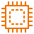 |
| amazonbraketmanagedsimulator | Res_Amazon-Braket_Managed-Simulator_48.svg |  |
| amazonbraketnoisesimulator | Res_Amazon-Braket_Noise-Simulator_48.svg |  |
| amazonbraketqpu | Res_Amazon-Braket_QPU_48.svg |  |
| amazonbraketsimulator | Res_Amazon-Braket_Simulator_48.svg |  |
| amazonbraketsimulator1 | Res_Amazon-Braket_Simulator-1_48.svg |  |
| amazonbraketsimulator2 | Res_Amazon-Braket_Simulator-2_48.svg |  |
| amazonbraketsimulator3 | Res_Amazon-Braket_Simulator-3_48.svg |  |
| amazonbraketsimulator4 | Res_Amazon-Braket_Simulator-4_48.svg |  |
| amazonbraketstatevector | Res_Amazon-Braket_State-Vector_48.svg |  |
| amazonbrakettensornetwork | Res_Amazon-Braket_Tensor-Network_48.svg | 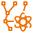 |
| amazonchime | Arch_Amazon-Chime_48.svg |  |
| amazonchimesdk | Arch_Amazon-Chime-SDK_48.svg |  |
| amazonclouddirectory | Arch_Amazon-Cloud-Directory_48.svg |  |
| amazoncloudfront | Arch_Amazon-CloudFront_48.svg |  |
| amazoncloudfrontdownloaddistribution | Res_Amazon-CloudFront_Download-Distribution_48.svg |  |
| amazoncloudfrontedgelocation | Res_Amazon-CloudFront_Edge-Location_48.svg |  |
| amazoncloudfrontfunctions | Res_Amazon-CloudFront_Functions_48.svg |  |
| amazoncloudfrontstreamingdistribution | Res_Amazon-CloudFront_Streaming-Distribution_48.svg |  |
| amazoncloudsearch | Arch_Amazon-CloudSearch_48.svg |  |
| amazoncloudsearchsearchdocuments | Res_Amazon-CloudSearch_Search-Documents_48.svg |  |
| amazoncloudwatch | Arch_Amazon-CloudWatch_48.svg |  |
| amazoncloudwatchalarm | Res_Amazon-CloudWatch_Alarm_48.svg |  |
| amazoncloudwatchcrossaccountobservability | Res_Amazon-CloudWatch_Cross-account-Observability_48.svg |  |
| amazoncloudwatchdataprotection | Res_Amazon-CloudWatch_Data-Protection_48.svg |  |
| amazoncloudwatcheventeventbased | Res_Amazon-CloudWatch_Event-Event-Based_48.svg |  |
| amazoncloudwatcheventtimebased | Res_Amazon-CloudWatch_Event-Time-Based_48.svg |  |
| amazoncloudwatchevidently | Res_Amazon-CloudWatch_Evidently_48.svg |  |
| amazoncloudwatchlogs | Res_Amazon-CloudWatch_Logs_48.svg |  |
| amazoncloudwatchmetricsinsights | Res_Amazon-CloudWatch_Metrics-Insights_48.svg |  |
| amazoncloudwatchrule | Res_Amazon-CloudWatch_Rule_48.svg |  |
| amazoncloudwatchrum | Res_Amazon-CloudWatch_RUM_48.svg |  |
| amazoncloudwatchsynthetics | Res_Amazon-CloudWatch_Synthetics_48.svg |  |
| amazoncodecatalyst | Arch_Amazon-CodeCatalyst_48.svg |  |
| amazoncodeguru | Arch_Amazon-CodeGuru_48.svg |  |
| amazoncodewhisperer | Arch_Amazon-CodeWhisperer_48.svg |  |
| amazoncognito | Arch_Amazon-Cognito_48.svg |  |
| amazoncomprehend | Arch_Amazon-Comprehend_48.svg |  |
| amazoncomprehendmedical | Arch_Amazon-Comprehend-Medical_48.svg |  |
| amazonconnect | Arch_Amazon-Connect_48.svg |  |
| amazoncorretto | Arch_Amazon-Corretto_48.svg |  |
| amazondatafirehose | Arch_Amazon-Data-Firehose_48.svg |  |
| amazondatazone | Arch_Amazon-DataZone_48.svg |  |
| amazondatazonebusinessdatacatalog | Res_Amazon-DataZone_Business-Data-Catalog_48.svg |  |
| amazondatazonedataportal | Res_Amazon-DataZone_Data-Portal_48.svg |  |
| amazondatazonedataprojects | Res_Amazon-DataZone_Data-Projects_48.svg |  |
| amazondcv | Arch_Amazon-DCV_48.svg |  |
| amazondetective | Arch_Amazon-Detective_48.svg |  |
| amazondevopsguru | Arch_Amazon-DevOps-Guru_48.svg |  |
| amazondevopsguruinsights | Res_Amazon-DevOps-Guru_Insights_48.svg |  |
| amazondocumentdb | Arch_Amazon-DocumentDB_48.svg |  |
| amazondocumentdbelasticclusters | Res_Amazon-DocumentDB_Elastic-Clusters_48.svg |  |
| amazondynamodb | Arch_Amazon-DynamoDB_48.svg |  |
| amazondynamodbamazondynamodbaccelerator | Res_Amazon-DynamoDB_Amazon-DynamoDB-Accelerator_48.svg |  |
| amazondynamodbattribute | Res_Amazon-DynamoDB_Attribute_48.svg |  |
| amazondynamodbattributes | Res_Amazon-DynamoDB_Attributes_48.svg |  |
| amazondynamodbglobalsecondaryindex | Res_Amazon-DynamoDB_Global-secondary-index_48.svg |  |
| amazondynamodbitem | Res_Amazon-DynamoDB_Item_48.svg |  |
| amazondynamodbitems | Res_Amazon-DynamoDB_Items_48.svg |  |
| amazondynamodbstandardaccesstableclass | Res_Amazon-DynamoDB_Standard-Access-Table-Class_48.svg |  |
| amazondynamodbstandardinfrequentaccesstableclass | Res_Amazon-DynamoDB_Standard-Infrequent-Access-Table-Class_48.svg |  |
| amazondynamodbstream | Res_Amazon-DynamoDB_Stream_48.svg |  |
| amazondynamodbtable | Res_Amazon-DynamoDB_Table_48.svg |  |
| amazonec2 | Arch_Amazon-EC2_48.svg |  |
| amazonec2ami | Res_Amazon-EC2_AMI_48.svg |  |
| amazonec2autoscaling | Res_Amazon-EC2_Auto-Scaling_48.svg |  |
| amazonec2awsmicroserviceextractorfornet | Res_Amazon-EC2_AWS-Microservice-Extractor-for-.NET_48.svg |  |
| amazonec2dbinstance | Res_Amazon-EC2_DB-Instance_48.svg |  |
| amazonec2elasticipaddress | Res_Amazon-EC2_Elastic-IP-Address_48.svg |  |
| amazonec2imagebuilder | Arch_Amazon-EC2-Image-Builder_48.svg |  |
| amazonec2instance | Res_Amazon-EC2_Instance_48.svg |  |
| amazonec2instances | Res_Amazon-EC2_Instances_48.svg |  |
| amazonec2instancewithcloudwatch | Res_Amazon-EC2_Instance-with-CloudWatch_48.svg |  |
| amazonec2rescue | Res_Amazon-EC2_Rescue_48.svg |  |
| amazonec2spotinstance | Res_Amazon-EC2_Spot-Instance_48.svg |  |
| amazonecsanywhere | Arch_Amazon-ECS-Anywhere_48.svg |  |
| amazonefs | Arch_Amazon-EFS_48.svg |  |
| amazoneksanywhere | Arch_Amazon-EKS-Anywhere_48.svg |  |
| amazonekscloud | Arch_Amazon-EKS-Cloud_48.svg |  |
| amazoneksdistro | Arch_Amazon-EKS-Distro_48.svg |  |
| amazonelasticache | Arch_Amazon-ElastiCache_48.svg |  |
| amazonelasticachecachenode | Res_Amazon-ElastiCache_Cache-Node_48.svg |  |
| amazonelasticacheelasticacheformemcached | Res_Amazon-ElastiCache_ElastiCache-for-Memcached_48.svg |  |
| amazonelasticacheelasticacheforredis | Res_Amazon-ElastiCache_ElastiCache-for-Redis_48.svg |  |
| amazonelasticacheelasticacheforvalkey | Res_Amazon-ElastiCache_ElastiCache-for-Valkey_48.svg |  |
| amazonelasticblockstore | Arch_Amazon-Elastic-Block-Store_48.svg |  |
| amazonelasticblockstoreamazondatalifecyclemanager | Res_Amazon-Elastic-Block-Store_Amazon-Data-Lifecycle-Manager_48.svg |  |
| amazonelasticblockstoremultiplevolumes | Res_Amazon-Elastic-Block-Store_Multiple-Volumes_48.svg |  |
| amazonelasticblockstoresnapshot | Res_Amazon-Elastic-Block-Store_Snapshot_48.svg |  |
| amazonelasticblockstorevolume | Res_Amazon-Elastic-Block-Store_Volume_48.svg |  |
| amazonelasticblockstorevolumegp3 | Res_Amazon-Elastic-Block-Store_Volume-gp3_48.svg |  |
| amazonelasticcontainerregistry | Arch_Amazon-Elastic-Container-Registry_48.svg |  |
| amazonelasticcontainerregistryimage | Res_Amazon-Elastic-Container-Registry_Image_48.svg |  |
| amazonelasticcontainerregistryregistry | Res_Amazon-Elastic-Container-Registry_Registry_48.svg |  |
| amazonelasticcontainerservice | Arch_Amazon-Elastic-Container-Service_48.svg |  |
| amazonelasticcontainerservicecontainer1 | Res_Amazon-Elastic-Container-Service_Container-1_48.svg |  |
| amazonelasticcontainerservicecontainer2 | Res_Amazon-Elastic-Container-Service_Container-2_48.svg |  |
| amazonelasticcontainerservicecontainer3 | Res_Amazon-Elastic-Container-Service_Container-3_48.svg |  |
| amazonelasticcontainerservicecopiiotcli | Res_Amazon-Elastic-Container-Service_CopiIoT-CLI_48.svg |  |
| amazonelasticcontainerserviceecsserviceconnect | Res_Amazon-Elastic-Container-Service_ECS-Service-Connect_48.svg |  |
| amazonelasticcontainerserviceservice | Res_Amazon-Elastic-Container-Service_Service_48.svg |  |
| amazonelasticcontainerservicetask | Res_Amazon-Elastic-Container-Service_Task_48.svg |  |
| amazonelasticfilesystemefsintelligenttiering | Res_Amazon-Elastic-File-System_EFS-Intelligent-Tiering_48.svg |  |
| amazonelasticfilesystemefsonezone | Res_Amazon-Elastic-File-System_EFS-One-Zone_48.svg |  |
| amazonelasticfilesystemefsonezoneinfrequentaccess | Res_Amazon-Elastic-File-System_EFS-One-Zone-Infrequent-Access_48.svg |  |
| amazonelasticfilesystemefsstandard | Res_Amazon-Elastic-File-System_EFS-Standard_48.svg |  |
| amazonelasticfilesystemefsstandardinfrequentaccess | Res_Amazon-Elastic-File-System_EFS-Standard-Infrequent-Access_48.svg |  |
| amazonelasticfilesystemelasticthroughput | Res_Amazon-Elastic-File-System_Elastic-Throughput_48.svg |  |
| amazonelasticfilesystemfilesystem | Res_Amazon-Elastic-File-System_File-System_48.svg |  |
| amazonelasticinference | Arch_Amazon-Elastic-Inference_48.svg |  |
| amazonelastickubernetesservice | Arch_Amazon-Elastic-Kubernetes-Service_48.svg |  |
| amazonelastickubernetesserviceeksonoutposts | Res_Amazon-Elastic-Kubernetes-Service_EKS-on-Outposts_48.svg |  |
| amazonelastictranscoder | Arch_Amazon-Elastic-Transcoder_48.svg |  |
| amazonelasticvmwareservice | Arch_Amazon-Elastic-VMware-Service_48.svg |  |
| amazonemr | Arch_Amazon-EMR_48.svg |  |
| amazonemrcluster | Res_Amazon-EMR_Cluster_48.svg |  |
| amazonemremrengine | Res_Amazon-EMR_EMR-Engine_48.svg |  |
| amazonemrhdfscluster | Res_Amazon-EMR_HDFS-Cluster_48.svg |  |
| amazoneventbridge | Arch_Amazon-EventBridge_48.svg |  |
| amazoneventbridgecustomeventbus | Res_Amazon-EventBridge_Custom-Event-Bus_48.svg |  |
| amazoneventbridgedefaulteventbus | Res_Amazon-EventBridge_Default-Event-Bus_48.svg |  |
| amazoneventbridgeevent | Res_Amazon-EventBridge-Event_48.svg |  |
| amazoneventbridgepipes | Res_Amazon-EventBridge_Pipes_48.svg |  |
| amazoneventbridgerule | Res_Amazon-EventBridge_Rule_48.svg |  |
| amazoneventbridgesaaspartnerevent | Res_Amazon-EventBridge_Saas-Partner-Event_48.svg |  |
| amazoneventbridgescheduler | Res_Amazon-EventBridge_Scheduler_48.svg |  |
| amazoneventbridgeschema | Res_Amazon-EventBridge_Schema_48.svg |  |
| amazoneventbridgeschemaregistry | Res_Amazon-EventBridge_Schema-Registry_48.svg |  |
| amazonfilecache | Arch_Amazon-File-Cache_48.svg |  |
| amazonfilecachehybridnfslinkeddatasets | Res_Amazon-File-Cache_Hybrid-NFS-linked-datasets_48.svg |  |
| amazonfilecacheonpremisesnfslinkeddatasets | Res_Amazon-File-Cache_On-premises-NFS-linked-datasets_48.svg |  |
| amazonfilecaches3linkeddatasets | Res_Amazon-File-Cache_S3-linked-datasets_48.svg |  |
| amazonfinspace | Arch_Amazon-FinSpace_48.svg |  |
| amazonforecast | Arch_Amazon-Forecast_48.svg |  |
| amazonfrauddetector | Arch_Amazon-Fraud-Detector_48.svg |  |
| amazonfsx | Arch_Amazon-FSx_48.svg |  |
| amazonfsxforlustre | Arch_Amazon-FSx-for-Lustre_48.svg |  |
| amazonfsxfornetappontap | Arch_Amazon-FSx-for-NetApp-ONTAP_48.svg |  |
| amazonfsxforopenzfs | Arch_Amazon-FSx-for-OpenZFS_48.svg |  |
| amazonfsxforwfs | Arch_Amazon-FSx-for-WFS_48.svg |  |
| amazongamelift | Arch_Amazon-GameLift_48.svg |  |
| amazonguardduty | Arch_Amazon-GuardDuty_48.svg |  |
| amazoninspector | Arch_Amazon-Inspector_48.svg |  |
| amazoninspectoragent | Res_Amazon-Inspector_Agent_48.svg |  |
| amazoninteractivevideoservice | Arch_Amazon-Interactive-Video-Service_48.svg |  |
| amazonkendra | Arch_Amazon-Kendra_48.svg |  |
| amazonkeyspaces | Arch_Amazon-Keyspaces_48.svg |  |
| amazonkinesis | Arch_Amazon-Kinesis_48.svg |  |
| amazonkinesisdatastreams | Arch_Amazon-Kinesis-Data-Streams_48.svg |  |
| amazonkinesisvideostreams | Arch_Amazon-Kinesis-Video-Streams_48.svg |  |
| amazonlex | Arch_Amazon-Lex_48.svg |  |
| amazonlightsail | Arch_Amazon-Lightsail_48.svg |  |
| amazonlightsailforresearch | Arch_Amazon-Lightsail-for-Research_48.svg |  |
| amazonlocationservice | Arch_Amazon-Location-Service_48.svg |  |
| amazonlocationservicegeofence | Res_Amazon-Location-Service_Geofence_48.svg |  |
| amazonlocationservicemap | Res_Amazon-Location-Service_Map _48.svg |  |
| amazonlocationserviceplace | Res_Amazon-Location-Service_Place_48.svg |  |
| amazonlocationserviceroutes | Res_Amazon-Location-Service_Routes_48.svg | 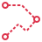 |
| amazonlocationservicetrack | Res_Amazon-Location-Service_Track _48.svg |  |
| amazonlookoutforequipment | Arch_Amazon-Lookout-for-Equipment_48.svg |  |
| amazonlookoutformetrics | Arch_Amazon-Lookout-for-Metrics_48.svg |  |
| amazonlookoutforvision | Arch_Amazon-Lookout-for-Vision_48.svg |  |
| amazonmacie | Arch_Amazon-Macie_48.svg |  |
| amazonmanagedblockchain | Arch_Amazon-Managed-Blockchain_48.svg |  |
| amazonmanagedblockchainblockchain | Res_Amazon-Managed-Blockchain_Blockchain_48.svg |  |
| amazonmanagedgrafana | Arch_Amazon-Managed-Grafana_48.svg |  |
| amazonmanagedserviceforapacheflink | Arch_Amazon-Managed-Service-for-Apache-Flink_48.svg |  |
| amazonmanagedserviceforprometheus | Arch_Amazon-Managed-Service-for-Prometheus_48.svg |  |
| amazonmanagedstreamingforapachekafka | Arch_Amazon-Managed-Streaming-for-Apache-Kafka_48.svg |  |
| amazonmanagedworkflowsforapacheairflow | Arch_Amazon-Managed-Workflows-for-Apache-Airflow_48.svg |  |
| amazonmemorydb | Arch_Amazon-MemoryDB_48.svg |  |
| amazonmonitron | Arch_Amazon-Monitron_48.svg |  |
| amazonmq | Arch_Amazon-MQ_48.svg |  |
| amazonmqbroker | Res_Amazon-MQ_Broker_48.svg |  |
| amazonmskamazonmskconnect | Res_Amazon-MSK_Amazon-MSK-Connect_48.svg |  |
| amazonneptune | Arch_Amazon-Neptune_48.svg |  |
| amazonnova | Arch_Amazon-Nova_48.svg |  |
| amazonopensearchservice | Arch_Amazon-OpenSearch-Service_48.svg |  |
| amazonopensearchserviceclusteradministratornode | Res_Amazon-OpenSearch-Service_Cluster-Administrator-Node_48.svg |  |
| amazonopensearchservicedatanode | Res_Amazon-OpenSearch-Service_Data-Node_48.svg |  |
| amazonopensearchserviceindex | Res_Amazon-OpenSearch-Service_Index_48.svg |  |
| amazonopensearchserviceobservability | Res_Amazon-OpenSearch-Service_Observability_48.svg |  |
| amazonopensearchserviceopensearchdashboards | Res_Amazon-OpenSearch-Service_OpenSearch-Dashboards_48.svg |  |
| amazonopensearchserviceopensearchingestion | Res_Amazon-OpenSearch-Service_OpenSearch-Ingestion_48.svg |  |
| amazonopensearchservicetraces | Res_Amazon-OpenSearch-Service_Traces_48.svg | 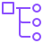 |
| amazonopensearchserviceultrawarmnode | Res_Amazon-OpenSearch-Service_UltraWarm-Node_48.svg |  |
| amazonpersonalize | Arch_Amazon-Personalize_48.svg |  |
| amazonpinpoint | Arch_Amazon-Pinpoint_48.svg |  |
| amazonpinpointapis | Arch_Amazon-Pinpoint-APIs_48.svg |  |
| amazonpinpointjourney | Res_Amazon-Pinpoint_Journey_48.svg |  |
| amazonpolly | Arch_Amazon-Polly_48.svg |  |
| amazonq | Arch_Amazon-Q_48.svg |  |
| amazonquantumledgerdatabase | Arch_Amazon-Quantum-Ledger-Database_48.svg |  |
| amazonquicksight | Arch_Amazon-QuickSight_48.svg |  |
| amazonquicksightpaginatedreports | Res_Amazon-Quicksight_Paginated-Reports_48.svg |  |
| amazonrds | Arch_Amazon-RDS_48.svg |  |
| amazonrdsbluegreendeployments | Res_Amazon-RDS_Blue-Green-Deployments_48.svg |  |
| amazonrdsmultiaz | Res_Amazon-RDS_Multi-AZ_48.svg |  |
| amazonrdsmultiazdbcluster | Res_Amazon-RDS_Multi-AZ-DB-Cluster_48.svg |  |
| amazonrdsoptimizedwrites | Res_Amazon-RDS_Optimized-Writes_48.svg |  |
| amazonrdsproxyinstance | Res_Amazon-RDS-Proxy-Instance_48.svg |  |
| amazonrdsproxyinstancealternate | Res_Amazon-RDS-Proxy-Instance-Alternate_48.svg |  |
| amazonrdstrustedlanguageextensionsforpostgresql | Res_Amazon-RDS_Trusted-Language-Extensions-for-PostgreSQL_48.svg |  |
| amazonredshift | Arch_Amazon-Redshift_48.svg |  |
| amazonredshiftautocopy | Res_Amazon-Redshift_Auto-copy_48.svg |  |
| amazonredshiftdatasharinggovernance | Res_Amazon-Redshift_Data-Sharing-Governance_48.svg |  |
| amazonredshiftdensecomputenode | Res_Amazon-Redshift_Dense-Compute-Node_48.svg |  |
| amazonredshiftdensestoragenode | Res_Amazon-Redshift_Dense-Storage-Node_48.svg |  |
| amazonredshiftml | Res_Amazon-Redshift_ML_48.svg |  |
| amazonredshiftqueryeditorv20 | Res_Amazon-Redshift_Query-Editor-v2.0_48.svg |  |
| amazonredshiftra3 | Res_Amazon-Redshift_RA3_48.svg |  |
| amazonredshiftstreamingingestion | Res_Amazon-Redshift_Streaming-Ingestion_48.svg |  |
| amazonrekognition | Arch_Amazon-Rekognition_48.svg |  |
| amazonrekognitionimage | Res_Amazon-Rekognition_Image_48.svg |  |
| amazonrekognitionvideo | Res_Amazon-Rekognition_Video_48.svg |  |
| amazonroute53 | Arch_Amazon-Route-53_48.svg |  |
| amazonroute53hostedzone | Res_Amazon-Route-53-Hosted-Zone_48.svg |  |
| amazonroute53readinesschecks | Res_Amazon-Route-53_Readiness-Checks_48.svg |  |
| amazonroute53resolver | Res_Amazon-Route-53_Resolver_48.svg |  |
| amazonroute53resolverdnsfirewall | Res_Amazon-Route-53_Resolver-DNS-Firewall_48.svg |  |
| amazonroute53resolverquerylogging | Res_Amazon-Route-53_Resolver-Query-Logging_48.svg |  |
| amazonroute53routetable | Res_Amazon-Route-53_Route-Table_48.svg | 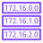 |
| amazonroute53routingcontrols | Res_Amazon-Route-53_Routing-Controls_48.svg |  |
| amazons3onoutposts | Arch_Amazon-S3-on-Outposts_48.svg |  |
| amazonsagemaker | Arch_Amazon-SageMaker_48.svg |  |
| amazonsagemakerai | Arch_Amazon-SageMaker-AI_48.svg |  |
| amazonsagemakercanvas | Res_Amazon-SageMaker_Canvas_48.svg |  |
| amazonsagemakergeospatialml | Res_Amazon-SageMaker_Geospatial-ML_48.svg |  |
| amazonsagemakergroundtruth | Arch_Amazon-SageMaker-Ground-Truth_48.svg |  |
| amazonsagemakermodel | Res_Amazon-SageMaker_Model_48.svg |  |
| amazonsagemakernotebook | Res_Amazon-SageMaker_Notebook_48.svg |  |
| amazonsagemakershadowtesting | Res_Amazon-SageMaker_Shadow-Testing_48.svg |  |
| amazonsagemakerstudiolab | Arch_Amazon-SageMaker-Studio-Lab_48.svg |  |
| amazonsagemakertrain | Res_Amazon-SageMaker_Train_48.svg |  |
| amazonsecuritylake | Arch_Amazon-Security-Lake_48.svg |  |
| amazonsimpleemailservice | Arch_Amazon-Simple-Email-Service_48.svg |  |
| amazonsimpleemailserviceemail | Res_Amazon-Simple-Email-Service_Email_48.svg |  |
| amazonsimplenotificationservice | Arch_Amazon-Simple-Notification-Service_48.svg |  |
| amazonsimplenotificationserviceemailnotification | Res_Amazon-Simple-Notification-Service_Email-Notification_48.svg |  |
| amazonsimplenotificationservicehttpnotification | Res_Amazon-Simple-Notification-Service_HTTP-Notification_48.svg |  |
| amazonsimplenotificationservicetopic | Res_Amazon-Simple-Notification-Service_Topic_48.svg |  |
| amazonsimplequeueservice | Arch_Amazon-Simple-Queue-Service_48.svg |  |
| amazonsimplequeueservicemessage | Res_Amazon-Simple-Queue-Service_Message_48.svg |  |
| amazonsimplequeueservicequeue | Res_Amazon-Simple-Queue-Service_Queue_48.svg |  |
| amazonsimplestorageservice | Arch_Amazon-Simple-Storage-Service_48.svg |  |
| amazonsimplestorageservicebucket | Res_Amazon-Simple-Storage-Service_Bucket_48.svg |  |
| amazonsimplestorageservicebucketwithobjects | Res_Amazon-Simple-Storage-Service_Bucket-With-Objects_48.svg |  |
| amazonsimplestorageservicedirectorybucket | Res_Amazon-Simple-Storage-Service_Directory-bucket_48.svg |  |
| amazonsimplestorageservicegeneralaccesspoints | Res_Amazon-Simple-Storage-Service_General-Access-Points_48.svg |  |
| amazonsimplestorageserviceglacier | Arch_Amazon-Simple-Storage-Service-Glacier_48.svg |  |
| amazonsimplestorageserviceglacierarchive | Res_Amazon-Simple-Storage-Service-Glacier_Archive_48.svg |  |
| amazonsimplestorageserviceglaciervault | Res_Amazon-Simple-Storage-Service-Glacier_Vault_48.svg |  |
| amazonsimplestorageserviceobject | Res_Amazon-Simple-Storage-Service_Object_48.svg |  |
| amazonsimplestorageservices3batchoperations | Res_Amazon-Simple-Storage-Service_S3-Batch-Operations_48.svg |  |
| amazonsimplestorageservices3expressonezone | Res_Amazon-Simple-Storage-Service_S3-Express-One-Zone_48.svg |  |
| amazonsimplestorageservices3glacierdeeparchive | Res_Amazon-Simple-Storage-Service_S3-Glacier-Deep-Archive_48.svg |  |
| amazonsimplestorageservices3glacierflexibleretrieval | Res_Amazon-Simple-Storage-Service_S3-Glacier-Flexible-Retrieval_48.svg |  |
| amazonsimplestorageservices3glacierinstantretrieval | Res_Amazon-Simple-Storage-Service_S3-Glacier-Instant-Retrieval_48.svg |  |
| amazonsimplestorageservices3intelligenttiering | Res_Amazon-Simple-Storage-Service_S3-Intelligent-Tiering_48.svg |  |
| amazonsimplestorageservices3multiregionaccesspoints | Res_Amazon-Simple-Storage-Service_S3-Multi-Region-Access-Points_48.svg |  |
| amazonsimplestorageservices3objectlambda | Res_Amazon-Simple-Storage-Service_S3-Object-Lambda_48.svg |  |
| amazonsimplestorageservices3objectlambdaaccesspoints | Res_Amazon-Simple-Storage-Service_S3-Object-Lambda-Access-Points_48.svg |  |
| amazonsimplestorageservices3objectlock | Res_Amazon-Simple-Storage-Service_S3-Object-Lock_48.svg |  |
| amazonsimplestorageservices3onezoneia | Res_Amazon-Simple-Storage-Service_S3-One-Zone-IA_48.svg |  |
| amazonsimplestorageservices3onoutposts | Res_Amazon-Simple-Storage-Service_S3-On-Outposts_48.svg |  |
| amazonsimplestorageservices3replication | Res_Amazon-Simple-Storage-Service_S3-Replication_48.svg |  |
| amazonsimplestorageservices3replicationtimecontrol | Res_Amazon-Simple-Storage-Service_S3-Replication-Time-Control_48.svg |  |
| amazonsimplestorageservices3select | Res_Amazon-Simple-Storage-Service_S3-Select_48.svg |  |
| amazonsimplestorageservices3standard | Res_Amazon-Simple-Storage-Service_S3-Standard_48.svg |  |
| amazonsimplestorageservices3standardia | Res_Amazon-Simple-Storage-Service_S3-Standard-IA_48.svg |  |
| amazonsimplestorageservices3storagelens | Res_Amazon-Simple-Storage-Service_S3-Storage-Lens_48.svg |  |
| amazonsimplestorageservices3tables | Res_Amazon-Simple-Storage-Service_S3-Tables_48.svg |  |
| amazonsimplestorageservicevpcaccesspoints | Res_Amazon-Simple-Storage-Service_VPC-Access-Points_48.svg |  |
| amazontextract | Arch_Amazon-Textract_48.svg |  |
| amazontextractanalyzelending | Res_Amazon-Textract_Analyze-Lending_48.svg |  |
| amazontimestream | Arch_Amazon-Timestream_48.svg |  |
| amazontranscribe | Arch_Amazon-Transcribe_48.svg |  |
| amazontranslate | Arch_Amazon-Translate_48.svg |  |
| amazonverifiedpermissions | Arch_Amazon-Verified-Permissions_48.svg |  |
| amazonvirtualprivatecloud | Arch_Amazon-Virtual-Private-Cloud_48.svg |  |
| amazonvpccarriergateway | Res_Amazon-VPC_Carrier-Gateway_48.svg |  |
| amazonvpccustomergateway | Res_Amazon-VPC_Customer-Gateway_48.svg |  |
| amazonvpcelasticnetworkadapter | Res_Amazon-VPC_Elastic-Network-Adapter_48.svg |  |
| amazonvpcelasticnetworkinterface | Res_Amazon-VPC_Elastic-Network-Interface_48.svg |  |
| amazonvpcendpoints | Res_Amazon-VPC_Endpoints_48.svg |  |
| amazonvpcflowlogs | Res_Amazon-VPC_Flow-Logs_48.svg |  |
| amazonvpcinternetgateway | Res_Amazon-VPC_Internet-Gateway_48.svg |  |
| amazonvpclattice | Arch_Amazon-VPC-Lattice_48.svg |  |
| amazonvpcnatgateway | Res_Amazon-VPC_NAT-Gateway_48.svg |  |
| amazonvpcnetworkaccessanalyzer | Res_Amazon-VPC_Network-Access-Analyzer_48.svg |  |
| amazonvpcnetworkaccesscontrollist | Res_Amazon-VPC_Network-Access-Control-List_48.svg |  |
| amazonvpcpeeringconnection | Res_Amazon-VPC_Peering-Connection_48.svg | 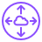 |
| amazonvpcreachabilityanalyzer | Res_Amazon-VPC_Reachability-Analyzer_48.svg |  |
| amazonvpcrouter | Res_Amazon-VPC_Router_48.svg |  |
| amazonvpctrafficmirroring | Res_Amazon-VPC_Traffic-Mirroring_48.svg |  |
| amazonvpcvirtualprivatecloudvpc | Res_Amazon-VPC_Virtual-private-cloud-VPC_48.svg |  |
| amazonvpcvpnconnection | Res_Amazon-VPC_VPN-Connection_48.svg |  |
| amazonvpcvpngateway | Res_Amazon-VPC_VPN-Gateway_48.svg |  |
| amazonworkdocs | Arch_Amazon-WorkDocs_48.svg |  |
| amazonworkdocssdk | Arch_Amazon-WorkDocs-SDK_48.svg |  |
| amazonworkmail | Arch_Amazon-WorkMail_48.svg |  |
| amazonworkspacesfamily | Arch_Amazon-WorkSpaces-Family_48.svg |  |
| amazonworkspacesfamilyamazonworkspaces | Res_Amazon-WorkSpaces-Family_Amazon-WorkSpaces_48.svg |  |
| amazonworkspacesfamilyamazonworkspacescore | Res_Amazon-WorkSpaces-Family_Amazon-WorkSpaces-Core_48.svg |  |
| amazonworkspacesfamilyamazonworkspacessecurebrowser | Res_Amazon-WorkSpaces-Family_Amazon-WorkSpaces-Secure-Browser_48.svg |  |
| apachemxnetonaws | Arch_Apache-MXNet-on-AWS_48.svg |  |
| archcategoryanalytics | Arch-Category_Analytics_48.svg |  |
| archcategoryapplicationintegration | Arch-Category_Application-Integration_48.svg |  |
| archcategoryartificialintelligence | Arch-Category_Artificial-Intelligence_48.svg |  |
| archcategoryblockchain | Arch-Category_Blockchain_48.svg |  |
| archcategorybusinessapplications | Arch-Category_Business-Applications_48.svg |  |
| archcategorycloudfinancialmanagement | Arch-Category_Cloud-Financial-Management_48.svg |  |
| archcategorycompute | Arch-Category_Compute_48.svg |  |
| archcategorycontactcenter | Arch-Category_Contact-Center_48.svg |  |
| archcategorycontainers | Arch-Category_Containers_48.svg |  |
| archcategorycustomerenablement | Arch-Category_Customer-Enablement_48.svg |  |
| archcategorydatabase | Arch-Category_Database_48.svg |  |
| archcategorydevelopertools | Arch-Category_Developer-Tools_48.svg |  |
| archcategoryendusercomputing | Arch-Category_End-User-Computing_48.svg |  |
| archcategoryfrontendwebmobile | Arch-Category_Front-End-Web-Mobile_48.svg |  |
| archcategorygames | Arch-Category_Games_48.svg |  |
| archcategoryinternetofthings | Arch-Category_Internet-of-Things_48.svg |  |
| archcategorymanagementgovernance | Arch-Category_Management-Governance_48.svg |  |
| archcategorymediaservices | Arch-Category_Media-Services_48.svg |  |
| archcategorymigrationmodernization | Arch-Category_Migration-Modernization_48.svg |  |
| archcategorynetworkingcontentdelivery | Arch-Category_Networking-Content-Delivery_48.svg |  |
| archcategoryquantumtechnologies | Arch-Category_Quantum-Technologies_48.svg |  |
| archcategoryrobotics | Arch-Category_Robotics_48.svg |  |
| archcategorysatellite | Arch-Category_Satellite_48.svg |  |
| archcategorysecurityidentitycompliance | Arch-Category_Security-Identity-Compliance_48.svg |  |
| archcategoryserverless | Arch-Category_Serverless_48.svg |  |
| archcategorystorage | Arch-Category_Storage_48.svg |  |
| authenticateduser48dark | Res_Authenticated-User_48_Dark.svg |  |
| authenticateduser48light | Res_Authenticated-User_48_Light.svg |  |
| awsactivate | Arch_AWS-Activate_48.svg |  |
| awsamplify | Arch_AWS-Amplify_48.svg |  |
| awsamplifyawsamplifystudio | Res_AWS-Amplify_AWS-Amplify-Studio_48.svg |  |
| awsappconfig | Arch_AWS-AppConfig_48.svg |  |
| awsappfabric | Arch_AWS-AppFabric_48.svg |  |
| awsapplicationautoscaling | Arch_AWS-Application-Auto-Scaling_48.svg |  |
| awsapplicationdiscoveryservice | Arch_AWS-Application-Discovery-Service_48.svg |  |
| awsapplicationdiscoveryserviceawsagentlesscollector | Res_AWS-Application-Discovery-Service_AWS-Agentless-Collector_48.svg |  |
| awsapplicationdiscoveryserviceawsdiscoveryagent | Res_AWS-Application-Discovery-Service_AWS-Discovery-Agent_48.svg |  |
| awsapplicationdiscoveryservicemigrationevaluatorcollector | Res_AWS-Application-Discovery-Service_Migration-Evaluator-Collector_48.svg |  |
| awsapplicationmigrationservice | Arch_AWS-Application-Migration-Service_48.svg |  |
| awsappmesh | Arch_AWS-App-Mesh_48.svg |  |
| awsappmeshmesh | Res_AWS-App-Mesh_Mesh_48.svg | 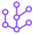 |
| awsappmeshvirtualgateway | Res_AWS-App-Mesh_Virtual-Gateway_48.svg |  |
| awsappmeshvirtualnode | Res_AWS-App-Mesh_Virtual-Node_48.svg |  |
| awsappmeshvirtualrouter | Res_AWS-App-Mesh_Virtual-Router_48.svg |  |
| awsappmeshvirtualservice | Res_AWS-App-Mesh_Virtual-Service_48.svg | 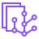 |
| awsapprunner | Arch_AWS-App-Runner_48.svg |  |
| awsappstudio | Arch_AWS-App-Studio_48.svg |  |
| awsappsync | Arch_AWS-AppSync_48.svg |  |
| awsartifact | Arch_AWS-Artifact_48.svg |  |
| awsauditmanager | Arch_AWS-Audit-Manager_48.svg |  |
| awsautoscaling | Arch_AWS-Auto-Scaling_48.svg |  |
| awsb2bdatainterchange | Arch_AWS-B2B-Data-Interchange_48.svg |  |
| awsbackintagent | Arch_AWS-Backint-Agent_48.svg |  |
| awsbackup | Arch_AWS-Backup_48.svg |  |
| awsbackupauditmanager | Res_AWS-Backup_Audit-Manager_48.svg |  |
| awsbackupawsbackupforawscloudformation | Res_AWS-Backup_AWS-Backup-for-AWS-CloudFormation_48.svg |  |
| awsbackupawsbackupsupportforamazonfsxfornetappontap | Res_AWS-Backup_AWS-Backup-support-for-Amazon-FSx-for-NetApp-ONTAP_48.svg |  |
| awsbackupawsbackupsupportforamazons3 | Res_AWS-Backup_AWS-Backup-support-for-Amazon-S3_48.svg |  |
| awsbackupawsbackupsupportforvmwareworkloads | Res_AWS-Backup_AWS-Backup-Support-for-VMware-Workloads_48.svg |  |
| awsbackupbackupplan | Res_AWS-Backup_Backup-Plan_48.svg |  |
| awsbackupbackuprestore | Res_AWS-Backup_Backup-Restore_48.svg |  |
| awsbackupbackupvault | Res_AWS-Backup_Backup-Vault_48.svg |  |
| awsbackupcompliancereporting | Res_AWS-Backup_Compliance-Reporting_48.svg |  |
| awsbackupcompute | Res_AWS-Backup_Compute_48.svg |  |
| awsbackupdatabase | Res_AWS-Backup_Database_48.svg |  |
| awsbackupgateway | Res_AWS-Backup_Gateway_48.svg |  |
| awsbackuplegalhold | Res_AWS-Backup_Legal-Hold_48.svg |  |
| awsbackuprecoverypointobjective | Res_AWS-Backup_Recovery-Point-Objective_48.svg |  |
| awsbackuprecoverytimeobjective | Res_AWS-Backup_Recovery-Time-Objective_48.svg |  |
| awsbackupstorage | Res_AWS-Backup_Storage_48.svg |  |
| awsbackupvaultlock | Res_AWS-Backup_Vault-Lock_48.svg |  |
| awsbackupvirtualmachine | Res_AWS-Backup_Virtual-Machine_48.svg |  |
| awsbackupvirtualmachinemonitor | Res_AWS-Backup_Virtual-Machine-Monitor_48.svg |  |
| awsbatch | Arch_AWS-Batch_48.svg |  |
| awsbillingconductor | Arch_AWS-Billing-Conductor_48.svg |  |
| awsbudgets | Arch_AWS-Budgets_48.svg |  |
| awscertificatemanager | Arch_AWS-Certificate-Manager_48.svg |  |
| awscertificatemanagercertificateauthority | Res_AWS-Certificate-Manager_Certificate-Authority_48.svg |  |
| awschatbot | Arch_AWS-Chatbot_48.svg |  |
| awscleanrooms | Arch_AWS-Clean-Rooms_48.svg |  |
| awsclientvpn | Arch_AWS-Client-VPN_48.svg |  |
| awscloud9 | Arch_AWS-Cloud9_48.svg |  |
| awscloud9cloud9 | Res_AWS-Cloud9_Cloud9_48.svg |  |
| awscloudcontrolapi | Arch_AWS-Cloud-Control-API_48.svg |  |
| awsclouddevelopmentkit | Arch_AWS-Cloud-Development-Kit_48.svg |  |
| awsclouddigitalinterface | Res_AWS-Cloud-Digital-Interface_48.svg |  |
| awscloudformation | Arch_AWS-CloudFormation_48.svg |  |
| awscloudformationchangeset | Res_AWS-CloudFormation_Change-Set_48.svg |  |
| awscloudformationstack | Res_AWS-CloudFormation_Stack_48.svg |  |
| awscloudformationtemplate | Res_AWS-CloudFormation_Template_48.svg |  |
| awscloudhsm | Arch_AWS-CloudHSM_48.svg |  |
| awscloudmap | Arch_AWS-Cloud-Map_48.svg |  |
| awscloudmapnamespace | Res_AWS-Cloud-Map_Namespace_48.svg |  |
| awscloudmapresource | Res_AWS-Cloud-Map_Resource_48.svg |  |
| awscloudmapservice | Res_AWS-Cloud-Map_Service_48.svg |  |
| awscloudshell | Arch_AWS-CloudShell_48.svg |  |
| awscloudtrail | Arch_AWS-CloudTrail_48.svg |  |
| awscloudtrailcloudtraillake | Res_AWS-CloudTrail_CloudTrail-Lake_48.svg |  |
| awscloudwan | Arch_AWS-Cloud-WAN_48.svg |  |
| awscloudwancorenetworkedge | Res_AWS-Cloud-WAN_Core-Network-Edge_48.svg |  |
| awscloudwansegmentnetwork | Res_AWS-Cloud-WAN_Segment-Network_48.svg |  |
| awscloudwantransitgatewayroutetableattachment | Res_AWS-Cloud-WAN_Transit-Gateway-Route-Table-Attachment_48.svg |  |
| awscodeartifact | Arch_AWS-CodeArtifact_48.svg |  |
| awscodebuild | Arch_AWS-CodeBuild_48.svg |  |
| awscodecommit | Arch_AWS-CodeCommit_48.svg |  |
| awscodedeploy | Arch_AWS-CodeDeploy_48.svg |  |
| awscodepipeline | Arch_AWS-CodePipeline_48.svg |  |
| awscommandlineinterface | Arch_AWS-Command-Line-Interface_48.svg |  |
| awscomputeoptimizer | Arch_AWS-Compute-Optimizer_48.svg |  |
| awsconfig | Arch_AWS-Config_48.svg |  |
| awsconsolemobileapplication | Arch_AWS-Console-Mobile-Application_48.svg |  |
| awscontroltower | Arch_AWS-Control-Tower_48.svg |  |
| awscostandusagereport | Arch_AWS-Cost-and-Usage-Report_48.svg |  |
| awscostexplorer | Arch_AWS-Cost-Explorer_48.svg |  |
| awsdatabasemigrationservice | Arch_AWS-Database-Migration-Service_48.svg |  |
| awsdatabasemigrationservicedatabasemigrationworkfloworjob | Res_AWS-Database-Migration-Service_Database-migration-workflow-or-job_48.svg |  |
| awsdataexchange | Arch_AWS-Data-Exchange_48.svg |  |
| awsdataexchangeforapis | Res_AWS-Data-Exchange-for-APIs_48.svg |  |
| awsdatasync | Arch_AWS-DataSync_48.svg |  |
| awsdatasyncagent | Res_AWS-Datasync_Agent_48.svg |  |
| awsdatasyncdiscovery | Res_AWS-DataSync_Discovery_48.svg |  |
| awsdatatransferterminal | Arch_AWS-Data-Transfer-Terminal_48.svg |  |
| awsdeadlinecloud | Arch_AWS-Deadline-Cloud_48.svg |  |
| awsdeepcomposer | Arch_AWS-DeepComposer_48.svg |  |
| awsdeeplearningamis | Arch_AWS-Deep-Learning-AMIs_48.svg |  |
| awsdeeplearningcontainers | Arch_AWS-Deep-Learning-Containers_48.svg |  |
| awsdeeplens | Arch_AWS-DeepLens_48.svg |  |
| awsdeepracer | Arch_AWS-DeepRacer_48.svg |  |
| awsdevicefarm | Arch_AWS-Device-Farm_48.svg |  |
| awsdirectconnect | Arch_AWS-Direct-Connect_48.svg |  |
| awsdirectconnectgateway | Res_AWS-Direct-Connect_Gateway_48.svg |  |
| awsdirectoryservice | Arch_AWS-Directory-Service_48.svg |  |
| awsdirectoryserviceadconnector | Res_AWS-Directory-Service_AD-Connector_48.svg |  |
| awsdirectoryserviceawsmanagedmicrosoftad | Res_AWS-Directory-Service_AWS-Managed-Microsoft-AD_48.svg |  |
| awsdirectoryservicesimplead | Res_AWS-Directory-Service_Simple-AD_48.svg |  |
| awsdistroforopentelemetry | Arch_AWS-Distro-for-OpenTelemetry_48.svg |  |
| awselasticbeanstalk | Arch_AWS-Elastic-Beanstalk_48.svg |  |
| awselasticbeanstalkapplication | Res_AWS-Elastic-Beanstalk_Application_48.svg |  |
| awselasticbeanstalkdeployment | Res_AWS-Elastic-Beanstalk_Deployment_48.svg |  |
| awselasticdisasterrecovery | Arch_AWS-Elastic-Disaster-Recovery_48.svg |  |
| awselementalappliancessoftware | Arch_AWS-Elemental-Appliances-&-Software_48.svg |  |
| awselementalconductor | Arch_AWS-Elemental-Conductor_48.svg |  |
| awselementaldelta | Arch_AWS-Elemental-Delta_48.svg |  |
| awselementallink | Arch_AWS-Elemental-Link_48.svg |  |
| awselementallive | Arch_AWS-Elemental-Live_48.svg |  |
| awselementalmediaconnect | Arch_AWS-Elemental-MediaConnect_48.svg |  |
| awselementalmediaconnectmediaconnectgateway | Res_AWS-Elemental-MediaConnect_MediaConnect-Gateway_48.svg |  |
| awselementalmediaconvert | Arch_AWS-Elemental-MediaConvert_48.svg |  |
| awselementalmedialive | Arch_AWS-Elemental-MediaLive_48.svg |  |
| awselementalmediapackage | Arch_AWS-Elemental-MediaPackage_48.svg |  |
| awselementalmediastore | Arch_AWS-Elemental-MediaStore_48.svg |  |
| awselementalmediatailor | Arch_AWS-Elemental-MediaTailor_48.svg |  |
| awselementalserver | Arch_AWS-Elemental-Server_48.svg |  |
| awsendusermessaging | Arch_AWS-End-User-Messaging_48.svg |  |
| awsentityresolution | Arch_AWS-Entity-Resolution_48.svg |  |
| awsexpressworkflows | Arch_AWS-Express-Workflows_48.svg |  |
| awsfargate | Arch_AWS-Fargate_48.svg |  |
| awsfaultinjectionservice | Arch_AWS-Fault-Injection-Service_48.svg |  |
| awsfirewallmanager | Arch_AWS-Firewall-Manager_48.svg |  |
| awsglobalaccelerator | Arch_AWS-Global-Accelerator_48.svg |  |
| awsglue | Arch_AWS-Glue_48.svg |  |
| awsglueawsglueforray | Res_AWS-Glue_AWS-Glue-for-Ray_48.svg | 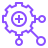 |
| awsgluecrawler | Res_AWS-Glue_Crawler_48.svg |  |
| awsgluedatabrew | Arch_AWS-Glue-DataBrew_48.svg |  |
| awsgluedatacatalog | Res_AWS-Glue_Data-Catalog_48.svg |  |
| awsgluedataquality | Res_AWS-Glue_Data-Quality_48.svg |  |
| awsgroundstation | Arch_AWS-Ground-Station_48.svg |  |
| awshealthdashboard | Arch_AWS-Health-Dashboard_48.svg |  |
| awshealthimaging | Arch_AWS-HealthImaging_48.svg |  |
| awshealthlake | Arch_AWS-HealthLake_48.svg |  |
| awshealthomics | Arch_AWS-HealthOmics_48.svg |  |
| awshealthscribe | Arch_AWS-HealthScribe_48.svg |  |
| awsiamidentitycenter | Arch_AWS-IAM-Identity-Center_48.svg |  |
| awsidentityaccessmanagementaddon | Res_AWS-Identity-Access-Management_Add-on_48.svg |  |
| awsidentityaccessmanagementawssts | Res_AWS-Identity-Access-Management_AWS-STS_48.svg |  |
| awsidentityaccessmanagementawsstsalternate | Res_AWS-Identity-Access-Management_AWS-STS-Alternate_48.svg |  |
| awsidentityaccessmanagementdataencryptionkey | Res_AWS-Identity-Access-Management_Data-Encryption-Key_48.svg |  |
| awsidentityaccessmanagementencrypteddata | Res_AWS-Identity-Access-Management_Encrypted-Data_48.svg |  |
| awsidentityaccessmanagementiamaccessanalyzer | Res_AWS-Identity-Access-Management_IAM-Access-Analyzer_48.svg |  |
| awsidentityaccessmanagementiamrolesanywhere | Res_AWS-Identity-Access-Management_IAM-Roles-Anywhere_48.svg |  |
| awsidentityaccessmanagementlongtermsecuritycredential | Res_AWS-Identity-Access-Management_Long-Term-Security-Credential_48.svg |  |
| awsidentityaccessmanagementmfatoken | Res_AWS-Identity-Access-Management_MFA-Token_48.svg |  |
| awsidentityaccessmanagementpermissions | Res_AWS-Identity-Access-Management_Permissions_48.svg |  |
| awsidentityaccessmanagementrole | Res_AWS-Identity-Access-Management_Role_48.svg |  |
| awsidentityaccessmanagementtemporarysecuritycredential | Res_AWS-Identity-Access-Management_Temporary-Security-Credential_48.svg |  |
| awsidentityandaccessmanagement | Arch_AWS-Identity-and-Access-Management_48.svg |  |
| awsinfrastructurecomposer | Arch_AWS-Infrastructure-Composer_48.svg |  |
| awsiotaction | Res_AWS-IoT_Action_48.svg |  |
| awsiotactuator | Res_AWS-IoT_Actuator_48.svg |  |
| awsiotalexaenableddevice | Res_AWS-IoT_Alexa_Enabled-Device_48.svg |  |
| awsiotalexaskill | Res_AWS-IoT_Alexa_Skill_48.svg |  |
| awsiotalexavoiceservice | Res_AWS-IoT_Alexa_Voice-Service_48.svg |  |
| awsiotanalytics | Arch_AWS-IoT-Analytics_48.svg |  |
| awsiotanalyticschannel | Res_AWS-IoT-Analytics_Channel_48.svg |  |
| awsiotanalyticsdataset | Res_AWS-IoT-Analytics_Dataset_48.svg |  |
| awsiotanalyticsdatastore | Res_AWS-IoT-Analytics_Data-Store_48.svg |  |
| awsiotanalyticsnotebook | Res_AWS-IoT-Analytics_Notebook_48.svg |  |
| awsiotanalyticspipeline | Res_AWS-IoT-Analytics_Pipeline_48.svg |  |
| awsiotbutton | Arch_AWS-IoT-Button_48.svg |  |
| awsiotcertificate | Res_AWS-IoT_Certificate_48.svg |  |
| awsiotcore | Arch_AWS-IoT-Core_48.svg |  |
| awsiotcoredeviceadvisor | Res_AWS-IoT-Core_Device-Advisor_48.svg |  |
| awsiotcoredevicelocation | Res_AWS-IoT-Core_Device-Location_48.svg |  |
| awsiotdesiredstate | Res_AWS-IoT_Desired-State_48.svg |  |
| awsiotdevicedefender | Arch_AWS-IoT-Device-Defender_48.svg |  |
| awsiotdevicedefenderiotdevicejobs | Res_AWS-IoT-Device-Defender_IoT-Device-Jobs_48.svg |  |
| awsiotdevicegateway | Res_AWS-IoT_Device-Gateway_48.svg |  |
| awsiotdevicemanagement | Arch_AWS-IoT-Device-Management_48.svg |  |
| awsiotdevicemanagementfleethub | Res_AWS-IoT-Device-Management_Fleet-Hub_48.svg |  |
| awsiotdevicetester | Res_AWS-IoT-Device-Tester_48.svg |  |
| awsiotecho | Res_AWS-IoT_Echo_48.svg |  |
| awsiotevents | Arch_AWS-IoT-Events_48.svg |  |
| awsiotexpresslink | Arch_AWS-IoT-ExpressLink_48.svg |  |
| awsiotfiretv | Res_AWS-IoT_Fire_TV_48.svg |  |
| awsiotfiretvstick | Res_AWS-IoT_Fire-TV_Stick_48.svg |  |
| awsiotfleetwise | Arch_AWS-IoT-FleetWise_48.svg |  |
| awsiotgreengrass | Arch_AWS-IoT-Greengrass_48.svg |  |
| awsiotgreengrassartifact | Res_AWS-IoT-Greengrass_Artifact_48.svg |  |
| awsiotgreengrasscomponent | Res_AWS-IoT-Greengrass_Component_48.svg |  |
| awsiotgreengrasscomponentmachinelearning | Res_AWS-IoT-Greengrass_Component-Machine-Learning_48.svg |  |
| awsiotgreengrasscomponentnucleus | Res_AWS-IoT-Greengrass_Component-Nucleus_48.svg |  |
| awsiotgreengrasscomponentprivate | Res_AWS-IoT-Greengrass_Component-Private_48.svg |  |
| awsiotgreengrasscomponentpublic | Res_AWS-IoT-Greengrass_Component-Public_48.svg |  |
| awsiotgreengrassconnector | Res_AWS-IoT-Greengrass_Connector_48.svg |  |
| awsiotgreengrassinterprocesscommunication | Res_AWS-IoT-Greengrass_Interprocess-Communication_48.svg |  |
| awsiotgreengrassprotocol | Res_AWS-IoT-Greengrass_Protocol_48.svg |  |
| awsiotgreengrassrecipe | Res_AWS-IoT-Greengrass_Recipe_48.svg |  |
| awsiotgreengrassstreammanager | Res_AWS-IoT-Greengrass_Stream-Manager_48.svg | 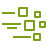 |
| awsiothardwareboard | Res_AWS-IoT-Hardware-Board_48.svg |  |
| awsiothttp2protocol | Res_AWS-IoT_HTTP2-Protocol_48.svg |  |
| awsiothttpprotocol | Res_AWS-IoT_HTTP_Protocol_48.svg |  |
| awsiotlambdafunction | Res_AWS-IoT_Lambda_Function_48.svg |  |
| awsiotlorawanprotocol | Res_AWS-IoT_LoRaWAN-Protocol_48.svg |  |
| awsiotmqttprotocol | Res_AWS-IoT_MQTT_Protocol_48.svg |  |
| awsiotoverairupdate | Res_AWS-IoT_Over-Air-Update_48.svg |  |
| awsiotpolicy | Res_AWS-IoT_Policy_48.svg |  |
| awsiotreportedstate | Res_AWS-IoT_Reported-State_48.svg |  |
| awsiotrule | Res_AWS-IoT-Rule_48.svg |  |
| awsiotsailboat | Res_AWS-IoT_Sailboat_48.svg |  |
| awsiotsensor | Res_AWS-IoT_Sensor_48.svg |  |
| awsiotservo | Res_AWS-IoT_Servo_48.svg |  |
| awsiotshadow | Res_AWS-IoT_Shadow_48.svg |  |
| awsiotsimulator | Res_AWS-IoT_Simulator_48.svg |  |
| awsiotsitewise | Arch_AWS-IoT-SiteWise_48.svg |  |
| awsiotsitewiseasset | Res_AWS-IoT-SiteWise_Asset_48.svg |  |
| awsiotsitewiseassethierarchy | Res_AWS-IoT-SiteWise_Asset-Hierarchy_48.svg | 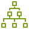 |
| awsiotsitewiseassetmodel | Res_AWS-IoT-SiteWise_Asset-Model_48.svg |  |
| awsiotsitewiseassetproperties | Res_AWS-IoT-SiteWise_Asset-Properties_48.svg |  |
| awsiotsitewisedatastreams | Res_AWS-IoT-SiteWise_Data-Streams_48.svg |  |
| awsiotthingbank | Res_AWS-IoT_Thing_Bank_48.svg |  |
| awsiotthingbicycle | Res_AWS-IoT_Thing_Bicycle_48.svg |  |
| awsiotthingcamera | Res_AWS-IoT_Thing_Camera_48.svg |  |
| awsiotthingcar | Res_AWS-IoT_Thing_Car_48.svg |  |
| awsiotthingcart | Res_AWS-IoT_Thing_Cart_48.svg |  |
| awsiotthingcoffeepot | Res_AWS-IoT_Thing_Coffee-Pot_48.svg |  |
| awsiotthingdoorlock | Res_AWS-IoT_Thing_Door-Lock_48.svg |  |
| awsiotthingfactory | Res_AWS-IoT_Thing_Factory_48.svg |  |
| awsiotthingfreertosdevice | Res_AWS-IoT_Thing_FreeRTOS-Device_48.svg |  |
| awsiotthinggeneric | Res_AWS-IoT_Thing_Generic_48.svg |  |
| awsiotthinghouse | Res_AWS-IoT_Thing_House_48.svg |  |
| awsiotthinghumiditysensor | Res_AWS-IoT_Thing_Humidity-Sensor_48.svg |  |
| awsiotthingindustrialpc | Res_AWS-IoT_Thing_Industrial-PC_48.svg |  |
| awsiotthinglightbulb | Res_AWS-IoT_Thing_Lightbulb_48.svg |  |
| awsiotthingmedicalemergency | Res_AWS-IoT_Thing_Medical-Emergency_48.svg |  |
| awsiotthingplc | Res_AWS-IoT_Thing_PLC_48.svg | 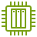 |
| awsiotthingpoliceemergency | Res_AWS-IoT_Thing_Police-Emergency_48.svg |  |
| awsiotthingrelay | Res_AWS-IoT_Thing_Relay_48.svg | 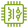 |
| awsiotthingstacklight | Res_AWS-IoT_Thing_Stacklight_48.svg |  |
| awsiotthingtemperaturehumiditysensor | Res_AWS-IoT_Thing_Temperature-Humidity-Sensor_48.svg |  |
| awsiotthingtemperaturesensor | Res_AWS-IoT_Thing_Temperature-Sensor_48.svg |  |
| awsiotthingtemperaturevibrationsensor | Res_AWS-IoT_Thing_Temperature-Vibration-Sensor_48.svg |  |
| awsiotthingthermostat | Res_AWS-IoT_Thing_Thermostat_48.svg |  |
| awsiotthingtravel | Res_AWS-IoT_Thing_Travel_48.svg |  |
| awsiotthingutility | Res_AWS-IoT_Thing_Utility_48.svg |  |
| awsiotthingvibrationsensor | Res_AWS-IoT_Thing_Vibration-Sensor_48.svg |  |
| awsiotthingwindfarm | Res_AWS-IoT_Thing_Windfarm_48.svg |  |
| awsiottopic | Res_AWS-IoT_Topic_48.svg |  |
| awsiottwinmaker | Arch_AWS-IoT-TwinMaker_48.svg |  |
| awsiq | Arch_AWS-IQ_48.svg |  |
| awskeymanagementservice | Arch_AWS-Key-Management-Service_48.svg |  |
| awskeymanagementserviceexternalkeystore | Res_AWS-Key-Management-Service_External-Key-Store_48.svg |  |
| awslakeformation | Arch_AWS-Lake-Formation_48.svg |  |
| awslakeformationdatalake | Res_AWS-Lake-Formation_Data-Lake_48.svg |  |
| awslambda | Arch_AWS-Lambda_48.svg |  |
| awslambdalambdafunction | Res_AWS-Lambda_Lambda-Function_48.svg |  |
| awslaunchwizard | Arch_AWS-Launch-Wizard_48.svg |  |
| awslicensemanager | Arch_AWS-License-Manager_48.svg |  |
| awslicensemanagerapplicationdiscovery | Res_AWS-License-Manager_Application-Discovery_48.svg |  |
| awslicensemanagerlicenseblending | Res_AWS-License-Manager_License-Blending_48.svg |  |
| awslocalzones | Arch_AWS-Local-Zones_48.svg |  |
| awsmainframemodernization | Arch_AWS-Mainframe-Modernization_48.svg |  |
| awsmainframemodernizationanalyzer | Res_AWS-Mainframe-Modernization_Analyzer_48.svg |  |
| awsmainframemodernizationcompiler | Res_AWS-Mainframe-Modernization_Compiler_48.svg |  |
| awsmainframemodernizationconverter | Res_AWS-Mainframe-Modernization_Converter_48.svg |  |
| awsmainframemodernizationdeveloper | Res_AWS-Mainframe-Modernization_Developer_48.svg |  |
| awsmainframemodernizationruntime | Res_AWS-Mainframe-Modernization_Runtime_48.svg |  |
| awsmanagedservices | Arch_AWS-Managed-Services_48.svg |  |
| awsmanagementconsole | Arch_AWS-Management-Console_48.svg |  |
| awsmanagementconsole48dark | Res_AWS-Management-Console_48_Dark.svg |  |
| awsmanagementconsole48light | Res_AWS-Management-Console_48_Light.svg |  |
| awsmarketplacedark | Arch_AWS-Marketplace_Dark_48.svg |  |
| awsmarketplacelight | Arch_AWS-Marketplace_Light_48.svg |  |
| awsmigrationevaluator | Arch_AWS-Migration-Evaluator_48.svg |  |
| awsmigrationhub | Arch_AWS-Migration-Hub_48.svg |  |
| awsmigrationhubrefactorspacesapplications | Res_AWS-Migration-Hub_Refactor-Spaces-Applications_48.svg |  |
| awsmigrationhubrefactorspacesenvironments | Res_AWS-Migration-Hub_Refactor-Spaces-Environments_48.svg |  |
| awsmigrationhubrefactorspacesservices | Res_AWS-Migration-Hub_Refactor-Spaces-Services_48.svg |  |
| awsnetworkfirewall | Arch_AWS-Network-Firewall_48.svg |  |
| awsnetworkfirewallendpoints | Res_AWS-Network-Firewall_Endpoints_48.svg |  |
| awsneuron | Arch_AWS-Neuron_48.svg |  |
| awsnitroenclaves | Arch_AWS-Nitro-Enclaves_48.svg |  |
| awsorganizations | Arch_AWS-Organizations_48.svg |  |
| awsorganizationsaccount | Res_AWS-Organizations_Account_48.svg |  |
| awsorganizationsmanagementaccount | Res_AWS-Organizations_Management-Account_48.svg |  |
| awsorganizationsorganizationalunit | Res_AWS-Organizations_Organizational-Unit_48.svg |  |
| awsoutpostsfamily | Arch_AWS-Outposts-family_48.svg |  |
| awsoutpostsrack | Arch_AWS-Outposts-rack_48.svg |  |
| awsoutpostsservers | Arch_AWS-Outposts-servers_48.svg |  |
| awspanorama | Arch_AWS-Panorama_48.svg |  |
| awsparallelcluster | Arch_AWS-Parallel-Cluster_48.svg |  |
| awsparallelcomputingservice | Arch_AWS-Parallel-Computing-Service_48.svg |  |
| awspaymentcryptography | Arch_AWS-Payment-Cryptography_48.svg |  |
| awsprivate5g | Arch_AWS-Private-5G_48.svg |  |
| awsprivatecertificateauthority | Arch_AWS-Private-Certificate-Authority_48.svg |  |
| awsprivatelink | Arch_AWS-PrivateLink_48.svg |  |
| awsprofessionalservices | Arch_AWS-Professional-Services_48.svg |  |
| awsproton | Arch_AWS-Proton_48.svg |  |
| awsrepost | Arch_AWS-rePost_48.svg |  |
| awsrepostprivate | Arch_AWS-rePost-Private_48.svg |  |
| awsresiliencehub | Arch_AWS-Resilience-Hub_48.svg |  |
| awsresourceaccessmanager | Arch_AWS-Resource-Access-Manager_48.svg |  |
| awsresourceexplorer | Arch_AWS-Resource-Explorer_48.svg |  |
| awsrobomaker | Arch_AWS-RoboMaker_48.svg |  |
| awsrobomakercloudextensionsros | Res_AWS-RoboMaker_Cloud-Extensions-ROS_48.svg | 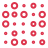 |
| awsrobomakerdevelopmentenvironment | Res_AWS-RoboMaker_Development-Environment_48.svg |  |
| awsrobomakerfleetmanagement | Res_AWS-RoboMaker_Fleet-Management_48.svg |  |
| awsrobomakersimulation | Res_AWS-RoboMaker_Simulation_48.svg |  |
| awssecretsmanager | Arch_AWS-Secrets-Manager_48.svg |  |
| awssecurityhub | Arch_AWS-Security-Hub_48.svg |  |
| awssecurityhubfinding | Res_AWS-Security-Hub_Finding_48.svg |  |
| awssecurityincidentresponse | Arch_AWS-Security-Incident-Response_48.svg |  |
| awsserverlessapplicationrepository | Arch_AWS-Serverless-Application-Repository_48.svg |  |
| awsservicecatalog | Arch_AWS-Service-Catalog_48.svg |  |
| awsservicemanagementconnector | Arch_AWS-Service-Management-Connector_48.svg |  |
| awsshield | Arch_AWS-Shield_48.svg |  |
| awsshieldawsshieldadvanced | Res_AWS-Shield_AWS-Shield-Advanced_48.svg |  |
| awssigner | Arch_AWS-Signer_48.svg |  |
| awssimspaceweaver | Arch_AWS-SimSpace-Weaver_48.svg |  |
| awssitetositevpn | Arch_AWS-Site-to-Site-VPN_48.svg |  |
| awssnowball | Arch_AWS-Snowball_48.svg |  |
| awssnowballedge | Arch_AWS-Snowball-Edge_48.svg |  |
| awssnowballsnowballimportexport | Res_AWS-Snowball_Snowball-Import-Export_48.svg |  |
| awsstepfunctions | Arch_AWS-Step-Functions_48.svg |  |
| awsstoragegateway | Arch_AWS-Storage-Gateway_48.svg |  |
| awsstoragegatewayamazonfsxfilegateway | Res_AWS-Storage-Gateway_Amazon-FSx-File-Gateway_48.svg |  |
| awsstoragegatewayamazons3filegateway | Res_AWS-Storage-Gateway_Amazon-S3-File-Gateway_48.svg |  |
| awsstoragegatewaycachedvolume | Res_AWS-Storage-Gateway_Cached-Volume_48.svg |  |
| awsstoragegatewayfilegateway | Res_AWS-Storage-Gateway_File-Gateway_48.svg |  |
| awsstoragegatewaynoncachedvolume | Res_AWS-Storage-Gateway_Noncached-Volume_48.svg |  |
| awsstoragegatewaytapegateway | Res_AWS-Storage-Gateway_Tape-Gateway_48.svg |  |
| awsstoragegatewayvirtualtapelibrary | Res_AWS-Storage-Gateway_Virtual-Tape-Library_48.svg |  |
| awsstoragegatewayvolumegateway | Res_AWS-Storage-Gateway_Volume-Gateway_48.svg |  |
| awssupplychain | Arch_AWS-Supply-Chain_48.svg |  |
| awssupport | Arch_AWS-Support_48.svg |  |
| awssystemsmanager | Arch_AWS-Systems-Manager_48.svg |  |
| awssystemsmanagerapplicationmanager | Res_AWS-Systems-Manager_Application-Manager_48.svg |  |
| awssystemsmanagerautomation | Res_AWS-Systems-Manager_Automation_48.svg |  |
| awssystemsmanagerchangecalendar | Res_AWS-Systems-Manager_Change-Calendar_48.svg |  |
| awssystemsmanagerchangemanager | Res_AWS-Systems-Manager_Change-Manager_48.svg |  |
| awssystemsmanagercompliance | Res_AWS-Systems-Manager_Compliance_48.svg |  |
| awssystemsmanagerdistributor | Res_AWS-Systems-Manager_Distributor_48.svg |  |
| awssystemsmanagerdocuments | Res_AWS-Systems-Manager_Documents_48.svg |  |
| awssystemsmanagerincidentmanager | Res_AWS-Systems-Manager_Incident-Manager_48.svg |  |
| awssystemsmanagerinventory | Res_AWS-Systems-Manager_Inventory_48.svg |  |
| awssystemsmanagermaintenancewindows | Res_AWS-Systems-Manager_Maintenance-Windows_48.svg |  |
| awssystemsmanageropscenter | Res_AWS-Systems-Manager_OpsCenter_48.svg |  |
| awssystemsmanagerparameterstore | Res_AWS-Systems-Manager_Parameter-Store_48.svg |  |
| awssystemsmanagerpatchmanager | Res_AWS-Systems-Manager_Patch-Manager_48.svg |  |
| awssystemsmanagerruncommand | Res_AWS-Systems-Manager_Run-Command_48.svg |  |
| awssystemsmanagersessionmanager | Res_AWS-Systems-Manager_Session-Manager_48.svg |  |
| awssystemsmanagerstatemanager | Res_AWS-Systems-Manager_State-Manager_48.svg |  |
| awstelconetworkbuilder | Arch_AWS-Telco-Network-Builder_48.svg |  |
| awsthinkboxdeadline | Arch_AWS-Thinkbox-Deadline_48.svg |  |
| awsthinkboxfrost | Arch_AWS-Thinkbox-Frost_48.svg |  |
| awsthinkboxkrakatoa | Arch_AWS-Thinkbox-Krakatoa_48.svg |  |
| awsthinkboxsequoia | Arch_AWS-Thinkbox-Sequoia_48.svg |  |
| awsthinkboxstoke | Arch_AWS-Thinkbox-Stoke_48.svg |  |
| awsthinkboxxmesh | Arch_AWS-Thinkbox-XMesh_48.svg |  |
| awstoolsandsdks | Arch_AWS-Tools-and-SDKs_48.svg |  |
| awstrainingcertification | Arch_AWS-Training-Certification_48.svg |  |
| awstransferfamily | Arch_AWS-Transfer-Family_48.svg |  |
| awstransferfamilyawsas2 | Res_AWS-Transfer-Family_AWS-AS2_48.svg |  |
| awstransferfamilyawsftp | Res_AWS-Transfer-Family_AWS-FTP_48.svg |  |
| awstransferfamilyawsftps | Res_AWS-Transfer-Family_AWS-FTPS_48.svg |  |
| awstransferfamilyawssftp | Res_AWS-Transfer-Family_AWS-SFTP_48.svg |  |
| awstransitgateway | Arch_AWS-Transit-Gateway_48.svg |  |
| awstransitgatewayattachment | Res_AWS-Transit-Gateway_Attachment_48.svg |  |
| awstrustedadvisor | Arch_AWS-Trusted-Advisor_48.svg |  |
| awstrustedadvisorchecklist | Res_AWS-Trusted-Advisor_Checklist_48.svg |  |
| awstrustedadvisorchecklistcost | Res_AWS-Trusted-Advisor_Checklist-Cost_48.svg |  |
| awstrustedadvisorchecklistfaulttolerant | Res_AWS-Trusted-Advisor_Checklist-Fault-Tolerant_48.svg |  |
| awstrustedadvisorchecklistperformance | Res_AWS-Trusted-Advisor_Checklist-Performance_48.svg |  |
| awstrustedadvisorchecklistsecurity | Res_AWS-Trusted-Advisor_Checklist-Security_48.svg |  |
| awsusernotifications | Arch_AWS-User-Notifications_48.svg |  |
| awsverifiedaccess | Arch_AWS-Verified-Access_48.svg |  |
| awswaf | Arch_AWS-WAF_48.svg |  |
| awswafbadbot | Res_AWS-WAF_Bad-Bot_48.svg |  |
| awswafbot | Res_AWS-WAF_Bot_48.svg |  |
| awswafbotcontrol | Res_AWS-WAF_Bot-Control_48.svg |  |
| awswaffilteringrule | Res_AWS-WAF_Filtering-Rule_48.svg |  |
| awswaflabels | Res_AWS-WAF_Labels_48.svg |  |
| awswafmanagedrule | Res_AWS-WAF_Managed-Rule_48.svg |  |
| awswafrule | Res_AWS-WAF_Rule_48.svg |  |
| awswavelength | Arch_AWS-Wavelength_48.svg |  |
| awswellarchitectedtool | Arch_AWS-Well-Architected-Tool_48.svg |  |
| awswickr | Arch_AWS-Wickr_48.svg |  |
| awsxray | Arch_AWS-X-Ray_48.svg |  |
| bottlerocket | Arch_Bottlerocket_48.svg |  |
| camera48dark | Res_Camera_48_Dark.svg |  |
| camera48light | Res_Camera_48_Light.svg |  |
| chat48dark | Res_Chat_48_Dark.svg |  |
| chat48light | Res_Chat_48_Light.svg |  |
| client48dark | Res_Client_48_Dark.svg |  |
| client48light | Res_Client_48_Light.svg |  |
| coldstorage48dark | Res_Cold-Storage_48_Dark.svg |  |
| coldstorage48light | Res_Cold-Storage_48_Light.svg |  |
| credentials48dark | Res_Credentials_48_Dark.svg |  |
| credentials48light | Res_Credentials_48_Light.svg |  |
| database48dark | Res_Database_48_Dark.svg |  |
| database48light | Res_Database_48_Light.svg |  |
| datastream48dark | Res_Data-Stream_48_Dark.svg |  |
| datastream48light | Res_Data-Stream_48_Light.svg |  |
| datatable48dark | Res_Data-Table_48_Dark.svg |  |
| datatable48light | Res_Data-Table_48_Light.svg |  |
| disk48dark | Res_Disk_48_Dark.svg |  |
| disk48light | Res_Disk_48_Light.svg |  |
| document48dark | Res_Document_48_Dark.svg |  |
| document48light | Res_Document_48_Light.svg |  |
| documents48dark | Res_Documents_48_Dark.svg |  |
| documents48light | Res_Documents_48_Light.svg |  |
| elasticfabricadapter | Arch_Elastic-Fabric-Adapter_48.svg |  |
| elasticloadbalancing | Arch_Elastic-Load-Balancing_48.svg |  |
| elasticloadbalancingapplicationloadbalancer | Res_Elastic-Load-Balancing_Application-Load-Balancer_48.svg |  |
| elasticloadbalancingclassicloadbalancer | Res_Elastic-Load-Balancing_Classic-Load-Balancer_48.svg |  |
| elasticloadbalancinggatewayloadbalancer | Res_Elastic-Load-Balancing_Gateway-Load-Balancer_48.svg |  |
| elasticloadbalancingnetworkloadbalancer | Res_Elastic-Load-Balancing_Network-Load-Balancer_48.svg |  |
| email48dark | Res_Email_48_Dark.svg |  |
| email48light | Res_Email_48_Light.svg |  |
| firewall48dark | Res_Firewall_48_Dark.svg |  |
| firewall48light | Res_Firewall_48_Light.svg |  |
| folder48dark | Res_Folder_48_Dark.svg |  |
| folder48light | Res_Folder_48_Light.svg |  |
| folders48dark | Res_Folders_48_Dark.svg |  |
| folders48light | Res_Folders_48_Light.svg |  |
| forums48dark | Res_Forums_48_Dark.svg |  |
| forums48light | Res_Forums_48_Light.svg |  |
| freertos | Arch_FreeRTOS_48.svg |  |
| gear48dark | Res_Gear_48_Dark.svg |  |
| gear48light | Res_Gear_48_Light.svg |  |
| genericapplication48dark | Res_Generic-Application_48_Dark.svg |  |
| genericapplication48light | Res_Generic-Application_48_Light.svg |  |
| gitrepository48dark | Res_Git-Repository_48_Dark.svg |  |
| gitrepository48light | Res_Git-Repository_48_Light.svg |  |
| globe48dark | Res_Globe_48_Dark.svg |  |
| globe48light | Res_Globe_48_Light.svg |  |
| internet48dark | Res_Internet_48_Dark.svg |  |
| internet48light | Res_Internet_48_Light.svg |  |
| internetalt148dark | Res_Internet-alt1_48_Dark.svg |  |
| internetalt148light | Res_Internet-alt1_48_Light.svg |  |
| internetalt248dark | Res_Internet-alt2_48_Dark.svg |  |
| internetalt248light | Res_Internet-alt2_48_Light.svg |  |
| jsonscript48dark | Res_JSON-Script_48_Dark.svg |  |
| jsonscript48light | Res_JSON-Script_48_Light.svg |  |
| logs48dark | Res_Logs_48_Dark.svg |  |
| logs48light | Res_Logs_48_Light.svg |  |
| magnifyingglass48dark | Res_Magnifying-Glass_48_Dark.svg |  |
| magnifyingglass48light | Res_Magnifying-Glass_48_Light.svg |  |
| metrics48dark | Res_Metrics_48_Dark.svg |  |
| metrics48light | Res_Metrics_48_Light.svg |  |
| mobileclient48dark | Res_Mobile-client_48_Dark.svg |  |
| mobileclient48light | Res_Mobile-client_48_Light.svg |  |
| multimedia48dark | Res_Multimedia_48_Dark.svg |  |
| multimedia48light | Res_Multimedia_48_Light.svg |  |
| niceenginframe | Arch_NICE-EnginFrame_48.svg |  |
| officebuilding48dark | Res_Office-building_48_Dark.svg |  |
| officebuilding48light | Res_Office-building_48_Light.svg |  |
| open3dengine | Arch_Open-3D-Engine_48.svg |  |
| oracledatabaseataws | Arch_Oracle-Database-at-AWS_48.svg |  |
| programminglanguage48dark | Res_Programming-Language_48_Dark.svg |  |
| programminglanguage48light | Res_Programming-Language_48_Light.svg |  |
| pytorchonaws | Arch_PyTorch-on-AWS_48.svg |  |
| question48dark | Res_Question_48_Dark.svg |  |
| question48light | Res_Question_48_Light.svg |  |
| recover48dark | Res_Recover_48_Dark.svg |  |
| recover48light | Res_Recover_48_Light.svg |  |
| redhatopenshiftserviceonaws | Arch_Red-Hat-OpenShift-Service-on-AWS_48.svg |  |
| reservedinstancereporting | Arch_Reserved-Instance-Reporting_48.svg |  |
| samltoken48dark | Res_SAML-token_48_Dark.svg |  |
| samltoken48light | Res_SAML-token_48_Light.svg |  |
| savingsplans | Arch_Savings-Plans_48.svg |  |
| sdk48dark | Res_SDK_48_Dark.svg |  |
| sdk48light | Res_SDK_48_Light.svg |  |
| server48dark | Res_Server_48_Dark.svg |  |
| server48light | Res_Server_48_Light.svg |  |
| servers48dark | Res_Servers_48_Dark.svg |  |
| servers48light | Res_Servers_48_Light.svg |  |
| shield48dark | Res_Shield_48_Dark.svg |  |
| shield48light | Res_Shield_48_Light.svg |  |
| sourcecode48dark | Res_Source-Code_48_Dark.svg |  |
| sourcecode48light | Res_Source-Code_48_Light.svg |  |
| sslpadlock48dark | Res_SSL-padlock_48_Dark.svg |  |
| sslpadlock48light | Res_SSL-padlock_48_Light.svg |  |
| tapestorage48dark | Res_Tape-storage_48_Dark.svg |  |
| tapestorage48light | Res_Tape-storage_48_Light.svg |  |
| tensorflowonaws | Arch_TensorFlow-on-AWS_48.svg |  |
| toolkit48dark | Res_Toolkit_48_Dark.svg |  |
| toolkit48light | Res_Toolkit_48_Light.svg |  |
| user48dark | Res_User_48_Dark.svg |  |
| user48light | Res_User_48_Light.svg |  |
| users48dark | Res_Users_48_Dark.svg |  |
| users48light | Res_Users_48_Light.svg |  |
